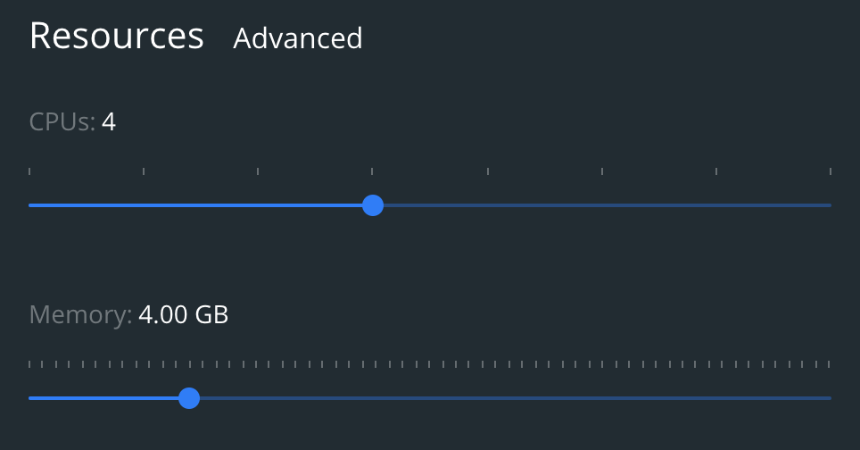

# Instructions
Please add the content of 20sites-html file. I excluded them for data privacy. Then build the Dockerfile.

```
docker build --pull --rm -f "Dockerfile" -t innonlpcase:lastest .
```

If you error with code 137, you should give more memory to Docker. See the issue: https://stackoverflow.com/questions/44907444/error-137-on-docker-build-command-on-win7


Run builded image with below command:

```
docker run --rm -it -v ~/results:/YOUR_PATH innonlpcase:lastest
```
-v is used for volume mapping. My code extracts keywords to json files under results directory. Volume mapping can take files from container to host. YOUR_PATH depends on your host, if you use windows you should use backslash.

If you don't want to use Docker, please install necessary libraries from requirements.txt.

# Keyword Proposition

Three different method is used to extract keywords and their weights. A sample output:
```
{
    "textRank": {
        "drying": 1.0,
        "microwave": 0.8826507013100974,
        "freeze": 0.6248281651395424,
        "vacuum": 0.5157771016591001,
        "state": 0.5040889599832689,
        "generators": 0.41675671554368887,
        "food": 0.40894037180616827,
        "solid": 0.4087194256912253,
        "mhz": 0.3477874574223804,
        "kw": 0.33804896209351115
    },
    "yake": {
        "microwave freeze-drying": 0.03392727696671845,
        "microwave": 0.03685164141220516,
        "vacuum freeze drying": 0.04291531864397426,
        "fricke and mallah": 0.05524795030388271,
        "mallah has acquired": 0.05524795030388271,
        "acquired a recognized": 0.05524795030388271,
        "recognized expertise": 0.05524795030388271,
        "drying": 0.056136540813108204,
        "freeze-drying": 0.056222902488159164,
        "pharmaceutical products fricke": 0.057679685662117494,
        "solid state microwave": 0.06588643175374513,
        "state microwave technology": 0.06795386355240016,
        "solid state": 0.06842659848002271,
        "vacuum": 0.06968699423134507,
        "microwave technology": 0.07694182951136348,
        "food": 0.08113006118124785,
        "state": 0.08633002172339996,
        "vacuum atmosphere": 0.09009833473579412,
        "state microwave": 0.09457991663486202,
        "generators": 0.10113395386892149
    },
    "keyBert": {
        "microwave": 0.4592,
        "microwaves": 0.4529,
        "drying": 0.3814,
        "heating": 0.2681,
        "freeze": 0.2666
    }
}
```

 First one is Text rank algorithm which is inherited from pagerank. It is faster than other methods, the most important word has 1.0 weight.

 Second one is YAKE, statistical n-gram using algorithm. Slower than textrank but it can extract phrases. The lower score means higher importance.

 Last one is keyBert, the transformer for keyword extraction. The slowest one, requires hardware and need to be optimized in many aspects such as word embedding selection(we might need finetunning), keyword n-gram range etc. In general, if you don't have enough data and hardware, using deep learning doesn't give the best solution.

 My suggestion is benefiting from the union or intersection of text rank and YAKE keywords.
